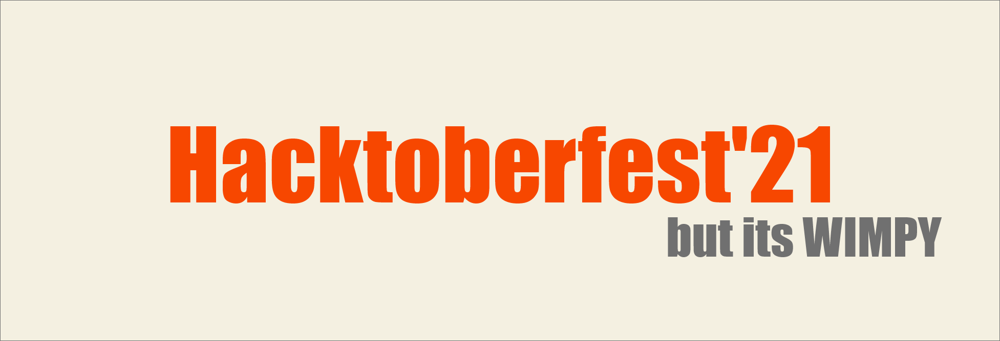

# HacktoberFest 2021

👉**What on earth is HacktoberFest?**

So a group of companies wanted to spread the word about Open Source, so they decided to keep a month long virtual event, where they reward you if you contribute to open source organisation/repositories. 

They give you **T-shirts** and other cool swags if you contribute to repos/issues tagged under the hacktoberfest label. 

I am gonna help you get that **T-shirt** and also get you started with your open source journey. 

All you need to do is open 4 Pull Requests (Relax, Just read along).

**Start your Open source Journey in Wimpy Style.**

👉First step is to get registered [here](https://hacktoberfest.digitalocean.com/).

👉Now that you registered, you need to make 4 PRs, but sadly you have no idea what the fu*ck that means. 

 💕 Dont Worry 

Just start by watching the following videos in the given order.

👉 **What the [heck  is open source](https://www.youtube.com/watch?v=7c0IrsDsNaw).**

👉 **What the [freak is git and github](https://www.youtube.com/watch?v=wpISo9TNjfU).**

👉 **How in the [world can I use Github](https://www.youtube.com/watch?v=RGOj5yH7evk)**.  (Long Version)

👉 **How in the [world can I use Github](https://www.youtube.com/watch?v=SWYqp7iY_Tc)**.  (Short Version)

👉**What the actual freak is [master/fork/fetch/pull/origin/head](https://acloudguru.com/blog/engineering/git-terms-explained)**.(Optional)

If you still don't understand anything.

 💕 Chillax

Just hit me up on [Linked](https://www.linkedin.com/in/kshitijdhyani/)/[Instagram](https://www.instagram.com/kshitij_dhyani/), and I will personally teach you over a video call. 

## First Contribution
Now that you have a basic idea of how to use git, let's make you contribute.

In other words, let's make you send a PR. (You need 4 of these)

I have listed a few projects of mine, where I would love to have your contributions. If any one of them interests you. Just click on it and explore. 

| Serial No. | Repository| What the heck is this| TechStack|
|:--|:--|:--|:--|
| 1. | [Goodmorning Girlfriend](https://github.com/wimpywarlord/Goodmorning-Girlfriend) | If you wanna automate GM/GN messages to your girlfriend this project is for you.  | `Vue.js` `Node.js` `Cron`  |
| 2. | [Amigos](https://github.com/wimpywarlord/Amigos) | If you wanna build Omegle for your College, this project is for you  | `HTML` `CSS` `Node.js` `MongoDB` |
| 3. | [AutoDocs](https://github.com/wimpywarlord/AutoDoc) | If you are into Blockchain, Crypto, and want to take DOGE coin to the moon.  | `Solidity` `Ethereum` `Web3` `HTML` |
| 4. | [Study-Buddy](https://github.com/wimpywarlord/Study-Buddy) | If you wanna create whatsapp groups for cheating in your University Exams, this project is for you.  | `HTML` `CSS` `Express.js` `JS` |
| 5. | [Btech-Blueprint](https://github.com/wimpywarlord/BTech-Blueprint) | If FFCS stand for Fully Fu*ked Up credit system for you, this project is for you.  | `HTML` `CSS` `JS` `Bootstrap` |
| 6. | [Portfolio](https://github.com/wimpywarlord) | If you help me improve my portfolio website, this project is for you.  | `HTML` `SCSS` `JS` |
| 7. | [MessItUp](https://github.com/wimpywarlord/Mess_It_Up) | If you want a project for your DBMS subject, this project is for you.  | `PHP` `SQL` `HTML` |

💀 **If you think, all these projects are wayyyyyyyyyyyyyy too complex for you to contribute**

 💕 Relax the Pillax

I got you. 

👉 I have prepared a list of **super simple easy peasy lemon squeezy** things for you to contribute to in each project (In more complex terms Beginner Friendly [Issues](https://www.youtube.com/watch?v=TKJ4RdhyB5Y)).

## Beginner-friendly issues
Detailed instructions are provided inside each Issue, so go ahead and open it. 

| Serial No. | Repository| Link to Issue  | Level |
|:--|:--|:--|:--|
| 1. | [Portfolio](https://github.com/wimpywarlord/wimpywarlord.github.io) | [Fix Spelling Free Lance](https://github.com/wimpywarlord/wimpywarlord.github.io/issues/5)  | `EASY`  |
| 2. | [Amigos](https://github.com/wimpywarlord/Amigos) | [Reposition the Disclaimer Button](https://github.com/wimpywarlord/Amigos/issues/1)  | `EASY` |
| 3. | [GoodMorning Girlfriend](https://github.com/wimpywarlord/Goodmorning-Girlfriend) | [Rick Roll the User](https://github.com/wimpywarlord/Goodmorning-Girlfriend/issues/1)  | `EASY`  |
| 4. | [Btech-Blueprint](https://github.com/wimpywarlord/BTech-Blueprint) | [Fix Spelling Free Lance](https://github.com/wimpywarlord/BTech-Blueprint/issues/1)  | `EASY`  |
| 5. | [AutoDocs](https://github.com/wimpywarlord/wimpywarlord.github.io) | [Authorize new Login Credentials](https://github.com/wimpywarlord/AutoDoc/issues/1)  | `EASY`  |

👉 Want more Begineer Friendly Issue? Check out the [issues.md](./Issues/issues.md) file or [this](https://github.com/vinitshahdeo/Hacktoberfest2021).

If at any point, you feel overwhelmed. 

 Take a Deep Breath

Don't give up just yet. You are almost there. 

 Let's Try again!

## Need help?

 👑 Stuck Somewhere?

Try googling and watch some youtube tutorials. Surfing Stackoverflow and github forums, might be a good option as well. 

Sitll Stuck?

Why worry? 

Just book a slot with me and schedule your 1hr video call for assistance.

Book your appointment with me [here](https://calendly.com/kshitijdhyani). 

It's Obviously **FREE**.

## Few Instructions

I hope this was fun.  

Let's cherish our collaboration forever. 

If I was able to help you get started with Open Source, add your name to the [mentees.md](./Mentees/mentees.md).

And [send a PR](https://docs.github.com/en/github/collaborating-with-pull-requests/proposing-changes-to-your-work-with-pull-requests/creating-a-pull-request) (I hope you can do this now).

💕I dont want this to end here, connect with me on [social media](https://www.linkedin.com/in/kshitijdhyani/) and 
👇

Let's Build Something Together.

  
